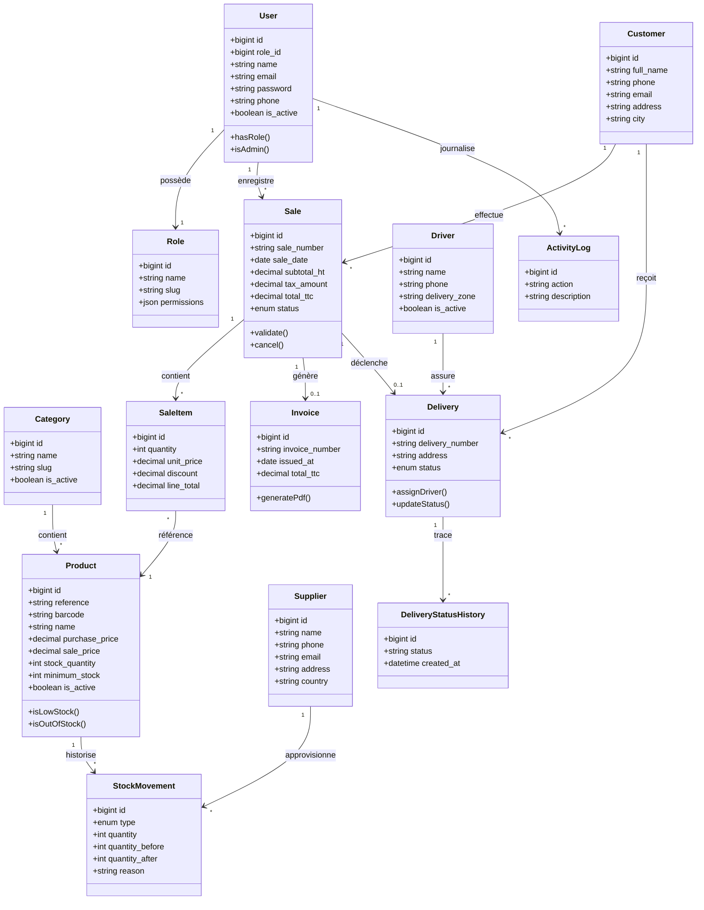
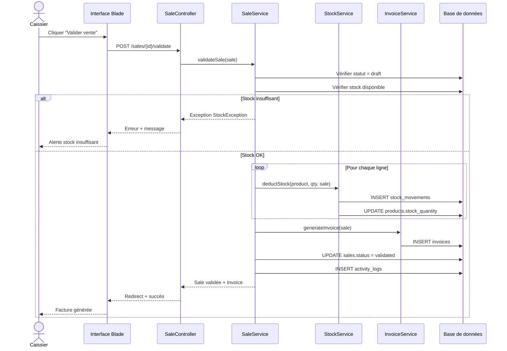
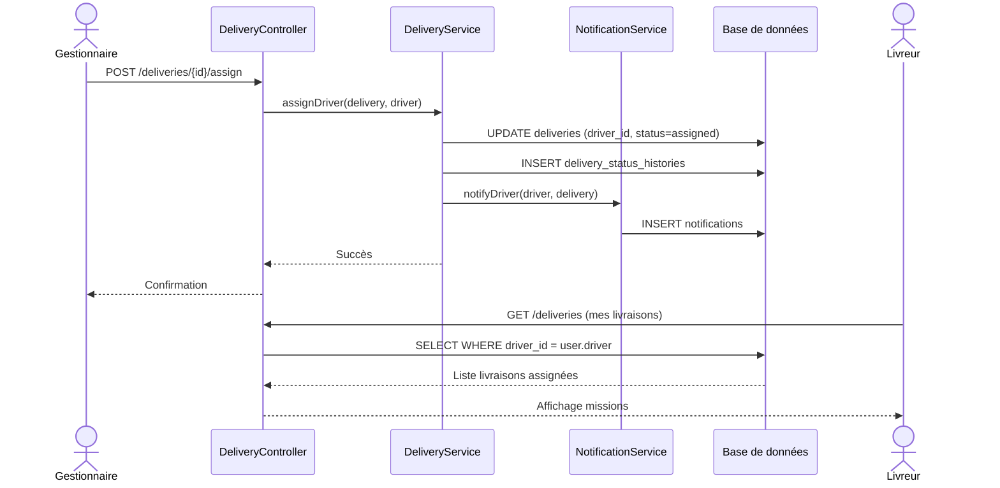
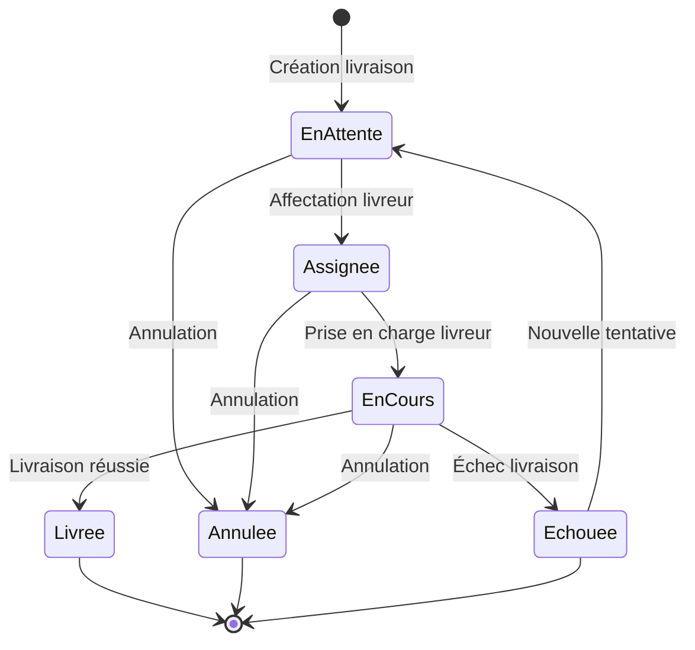
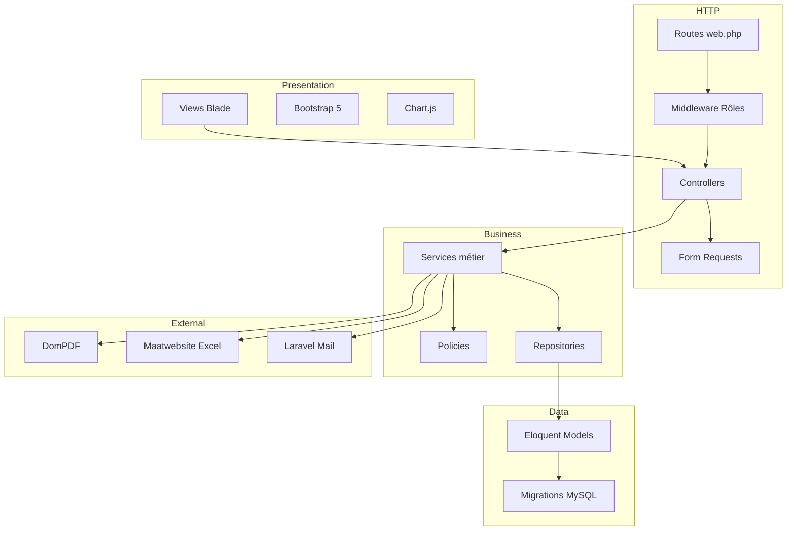

# Diagrammes UML — SI Boutique Gaming

## 1. Diagramme de cas d'utilisation

```mermaid
flowchart TB
    subgraph Acteurs
        Admin((Administrateur))
        Manager((Gestionnaire))
        Cashier((Caissier))
        Driver((Livreur))
    end

    subgraph Authentification
        UC01[Se connecter]
        UC02[Se déconnecter]
        UC03[Réinitialiser mot de passe]
    end

    subgraph Gestion_Utilisateurs
        UC04[Gérer utilisateurs]
        UC05[Gérer rôles]
    end

    subgraph Catalogue
        UC06[Gérer produits]
        UC07[Gérer catégories]
        UC08[Importer/Exporter Excel]
    end

    subgraph Stock
        UC09[Gérer entrées stock]
        UC10[Gérer sorties stock]
        UC11[Effectuer inventaire]
        UC12[Consulter historique stock]
        UC13[Recevoir alertes stock]
    end

    subgraph Fournisseurs
        UC14[Gérer fournisseurs]
        UC15[Consulter historique appro]
    end

    subgraph Clients
        UC16[Gérer clients]
        UC17[Consulter historique achats]
    end

    subgraph Ventes_Factures
        UC18[Créer vente]
        UC19[Valider vente]
        UC20[Annuler vente]
        UC21[Générer facture PDF]
        UC22[Consulter factures]
    end

    subgraph Livraisons
        UC23[Gérer livraisons]
        UC24[Affecter livreur]
        UC25[Mettre à jour statut livraison]
        UC26[Suivre livraison]
    end

    subgraph Livreurs
        UC27[Gérer livreurs]
        UC28[Consulter missions]
    end

    subgraph Reporting
        UC29[Consulter dashboard]
        UC30[Générer rapports]
        UC31[Exporter PDF/Excel]
    end

    subgraph Notifications
        UC32[Recevoir notifications]
    end

    Admin --> UC01 & UC02 & UC03 & UC04 & UC05
    Admin --> UC06 & UC07 & UC08 & UC09 & UC10 & UC11 & UC12
    Admin --> UC14 & UC15 & UC16 & UC17 & UC18 & UC19 & UC20
    Admin --> UC21 & UC22 & UC23 & UC24 & UC27 & UC29 & UC30 & UC31

    Manager --> UC01 & UC02 & UC03
    Manager --> UC06 & UC07 & UC08 & UC09 & UC10 & UC11 & UC12 & UC13
    Manager --> UC14 & UC15 & UC18 & UC19 & UC20 & UC23 & UC24 & UC27
    Manager --> UC29 & UC30 & UC31 & UC32

    Cashier --> UC01 & UC02 & UC03
    Cashier --> UC16 & UC17 & UC18 & UC19 & UC20 & UC21 & UC22 & UC32

    Driver --> UC01 & UC02 & UC03
    Driver --> UC25 & UC26 & UC28 & UC32
```

---

## 2. Diagramme de classes (domaine métier)

---

## 3. Diagramme de séquence — Validation d'une vente

---

## 4. Diagramme de séquence — Affectation livraison

---

## 5. Diagramme d'activité — Cycle de vie d'une livraison

---

## 6. Diagramme de composants (architecture Laravel)

